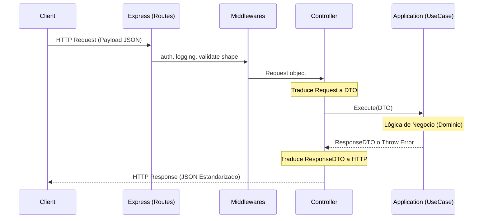

# Backend HTTP Architecture (Sprint 5)

**Estado:** Normativo  
**Fecha:** 16 de Julio de 2026

## 1. Principios Arquitectónicos
Este documento define las reglas de diseño para la Delivery Layer (Infraestructura HTTP) de RF_Observatory, garantizando que el framework web (Express) actúe únicamente como un mecanismo de transporte. 

**Decisiones Clave:**
- **DA-030:** La API REST nunca contendrá lógica de negocio.
- **DA-031:** Las fronteras traducen, nunca deciden.
- **DA-032:** HTTP es reemplazable. (La capa de aplicación no distingue el transporte).

---

## 2. Diagrama de Capas y Flujo HTTP

---

## 3. Estructura de Directorios

La capa de entrega HTTP se estructura en `backend/src/` bajo los siguientes directorios:

- `routes/`: Registra los endpoints y mapea los métodos HTTP (GET, POST, etc.) a un Controller específico. **No contiene lógica.**
- `controllers/`: El traductor principal. Recibe el Request, extrae parámetros (body, params, query), ensambla el DTO de entrada, invoca el Use Case de la Application Layer y devuelve la respuesta HTTP formateada.
- `middlewares/`: Funciones interceptoras para Express. Incluye manejo global de errores (Error Handler), logging de peticiones, validación de esquemas (opcional antes del Controller) y seguridad.
- `errors/`: Define el Modelo Único de Errores HTTP (ej. mapeo de `ApplicationError` a códigos `4xx/5xx`).
- `responses/`: Define el estándar único de respuesta REST (Success, Metadata, Errors).
- `http/`: Utilidades exclusivas del protocolo HTTP (ej. parsers especializados).
- `config/`: Configuración del servidor (puerto, CORS, inicialización de Express).

---

## 4. Responsabilidades y Restricciones

### Controllers
- **Deben:** Recibir el objeto de Express (Request/Response), extraer los datos, invocar el Use Case de la Application Layer, mapear la respuesta al estándar definido en `responses/` y manejar los códigos de estado de éxito (200, 201).
- **NO DEBEN:** Tomar decisiones de negocio, usar condicionales basados en el estado del dominio, invocar repositorios, conocer a Prisma o SQL.

### Routes
- **Deben:** Agrupar endpoints lógicamente (ej. `/api/v1/captures`), inyectar middlewares y rutear al controller correspondiente.
- **NO DEBEN:** Procesar parámetros de entrada ni contener funciones anónimas complejas.

### Middlewares
- **Deben:** Manejar tareas transversales (Cross-Cutting Concerns) de infraestructura.
- **NO DEBEN:** Alterar el estado de las entidades del dominio.

### Application Layer (Use Cases)
- **NO DEBEN:** Conocer el objeto `req` o `res`, saber qué es un código `404` o `500`, importar dependencias de Express ni saber que están siendo invocados mediante una API web.

---

## 5. Ejemplo de Flujo de Datos

1. **Cliente envía:** `POST /api/v1/protocols` con JSON body.
2. **Routes (`protocol.routes.ts`):** Intercepta el POST y lo envía a `ProtocolController.register`.
3. **Controller (`ProtocolController.ts`):** Extrae el JSON. Instancia `RegisterKnownProtocolRequestDTO`. Llama a `useCase.execute(dto)`.
4. **Application (`RegisterKnownProtocolUseCase.ts`):** Valida el DTO mediante `Validator`. Solicita al `Repository` que verifique duplicados. Llama al `Dominio` para crear la entidad. Guarda en el Repositorio. Devuelve `RegisterKnownProtocolResponseDTO`.
5. **Controller:** Recibe el ResponseDTO. Llama a `res.status(201).json(StandardSuccessResponse(ResponseDTO))`.
6. *(En caso de fallo)*: El UseCase arroja `ApplicationError('PROTOCOL_ALREADY_EXISTS')`. El *Error Middleware* lo captura, busca en el mapa de `errors/` y devuelve un HTTP `409 Conflict` con un JSON estandarizado.
