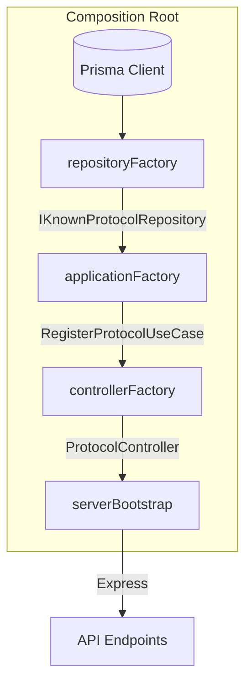

# Dependency Injection Bootstrap Architecture

**Proyecto:** RF_Observatory  
**Estado:** Normativo  
**Fecha:** 16 de Julio de 2026

## 1. Objetivo y Principios
Este documento diseña la orquestación y ensamblaje manual de todas las dependencias del RF_Observatory. Se prohíbe el uso de contenedores IoC mágicos (Inversify, TSyringe, NestJS) en esta etapa para privilegiar el control, la comprensión del grafo de dependencias y la adherencia estricta a Clean Architecture.

**Decisiones Clave:**
- **DA-037 (Existe un único Composition Root):** Toda instancia de clase del negocio e infraestructura se construye en un único lugar lógico. Un Controller jamás hará `new UseCase()`.
- **DA-038 (La composición ocurre una sola vez):** El ensamblaje de clases (`new ...`) sucede exclusivamente durante la fase de *Bootstrap* al arrancar el sistema.

## 2. Concepto de Composition Root
El *Composition Root* es la zona más "sucia" del sistema (porque conoce a todas las capas), y por ello debe estar estrictamente confinada. Es el único módulo autorizado para importar tanto implementaciones de infraestructura (`PrismaProtocolRepository`) como Casos de Uso del Dominio (`RegisterKnownProtocolUseCase`).

Su flujo de construcción (Dependency Graph) siempre es *Bottom-Up* (de la infraestructura hacia las capas superiores):
1. Instanciar conexión a BD (Prisma).
2. Instanciar Repositorios inyectando Prisma.
3. Instanciar Casos de Uso inyectando Repositorios (Interfaces).
4. Instanciar Controladores inyectando Casos de Uso.
5. Inyectar Controladores en Rutas (Express).

## 3. Estructura de Factories (`backend/src/bootstrap/`)
Para mantener el código organizado a medida que crece el número de endpoints, el *Composition Root* se dividirá en *Factories*:

### `repositoryFactory.ts`
**Responsabilidad:** Crear las instancias concretas que interactúan con la BD y bases de datos vectoriales.
- **Conoce:** Implementaciones concretas (`PrismaKnownProtocolRepository`, etc.).
- **Retorna:** Objetos que cumplen con las interfaces de dominio (`IKnownProtocolRepository`).

### `applicationFactory.ts`
**Responsabilidad:** Crear instancias de los Casos de Uso de la Application Layer.
- **Inyecta:** Las dependencias generadas por `repositoryFactory`.
- **Conoce:** Las clases concretas de los Use Cases.

### `controllerFactory.ts`
**Responsabilidad:** Construir los Controladores HTTP.
- **Inyecta:** Las dependencias generadas por `applicationFactory`.
- **Conoce:** Las clases concretas de los Controllers.

### `serverBootstrap.ts`
**Responsabilidad:** Arrancar el servidor Express, orquestar las rutas y amarrarlo todo.
- **Flujo:** Llama a los *factories*, ensambla el Router de Express y expone el puerto.

## 4. Restricciones y Dependencias Prohibidas

| Capa | Prohibición Estricta |
|---|---|
| **Controllers** | NO pueden usar la palabra clave `new` para instanciar UseCases ni Repositorios. NO conocen Prisma. |
| **Routes** | NO instancian Controllers. Reciben las referencias al método (Ej: `router.post('/', controller.handle)`). |
| **Use Cases** | NO conocen el `bootstrap/` ni los *Factories*. Solo declaran dependencias en su constructor (`constructor(private repo: IRepository)`). |
| **Domain** | Agnóstico absoluto. Desconoce la existencia de la red, los controladores y el inyector. |

## 5. Justificación de Inyección Manual vs Framework IoC
Actualmente RF_Observatory tiene 8 Casos de Uso. Añadir un Framework IoC requeriría esparcir decoradores (`@Injectable()`, `@Inject()`) a lo largo de toda la Application Layer, manchando el código de lógica ajena al negocio y acoplando la arquitectura limpia a una librería de terceros.
El ensamblaje explícito mediante *Factories* previene este "Framework Lock-in", garantiza comprobaciones de tipo en tiempo de compilación y expone claramente las dependencias circulares. Si el proyecto llega a tener cientos de casos de uso y la inyección manual resulta insostenible, migrar a un IoC será trivial, dado que las clases no estarán casadas con ningún framework de inyección previa.

## 6. Diagrama de Ensamblaje (Flujo Estructural)

