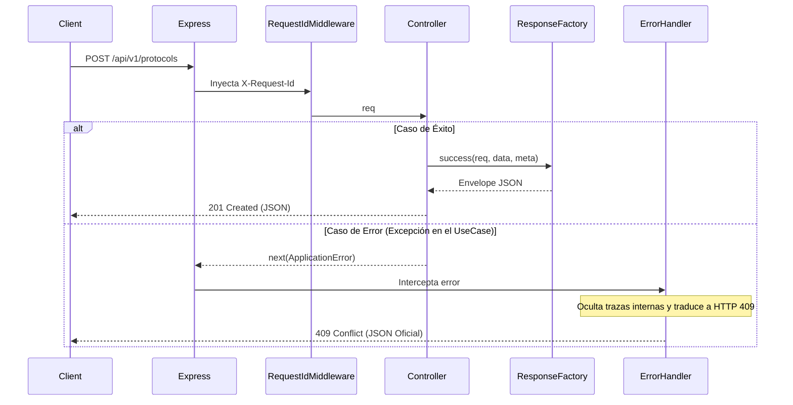

# HTTP Infrastructure (Sprint 5)

**Proyecto:** RF_Observatory  
**Estado:** Normativo  
**Fecha:** 16 de Julio de 2026

## 1. Objetivos y Principios
Este documento explica la infraestructura HTTP transversal construida para dar soporte a los controladores de la API REST. El propósito es centralizar la lógica de formato de respuestas, manejo de errores y trazas, garantizando que todos los endpoints mantengan un comportamiento idéntico sin duplicar código.

**Decisiones Clave (Casebook):**
- **DA-039 (Los Controllers no formatean respuestas):** Prohibido armar JSONs a mano en los controladores; se usan Factories.
- **DA-040 (La infraestructura es reutilizable):** Todo *cross-cutting concern* (como inyectar RequestId o interceptar 404s) es responsabilidad de un middleware central, no de un controlador.

## 2. Componentes de la Infraestructura

### 2.1. `ResponseFactory`
**Ruta:** `backend/src/responses/ResponseFactory.ts`
Implementa el contrato definido en `22_RestResponseStandard.md`.
Provee un método estático `ResponseFactory.success(...)` que envuelve la respuesta de negocio (`data`) en el *Envelope* oficial, extrayendo el `requestId` de la petición original e inyectando un `timestamp` unificado.

### 2.2. `ErrorFactory`
**Ruta:** `backend/src/errors/ErrorFactory.ts`
Implementa el contrato definido en `21_ApiErrorModel.md`.
Provee un método `ErrorFactory.create(...)` que genera la estructura rígida de errores (incluyendo `code`, `status`, `title`, `detail`, `path`).

### 2.3. `RequestIdMiddleware`
**Ruta:** `backend/src/middlewares/RequestIdMiddleware.ts`
Garantiza que toda solicitud que ingresa a Express reciba un identificador único (UUID). Lo inyecta en `req.headers['x-request-id']` para que las *Factories* puedan leerlo, y lo devuelve al cliente como header `X-Request-Id`.

### 2.4. `NotFoundMiddleware`
**Ruta:** `backend/src/middlewares/NotFoundMiddleware.ts`
Se ejecuta al final de las rutas de Express. Si ninguna ruta hizo *match*, este middleware toma el control y devuelve un `404` formal usando `ErrorFactory`, previniendo que Express devuelva su clásico HTML (ej. `Cannot GET /ruta`).

### 2.5. `GlobalErrorHandler`
**Ruta:** `backend/src/middlewares/GlobalErrorHandler.ts`
El guardián final del servidor. Intercepta excepciones arrojadas por los controladores o casos de uso. Su deber fundamental es:
1. Evitar que caiga el servidor.
2. Evitar que se filtren *Stack Traces* y datos de infraestructura (como consultas SQL).
3. Transformar la excepción en un JSON estandarizado vía `ErrorFactory`.

## 3. Flujo HTTP de un Endpoint (Con la infraestructura en uso)

## 4. Reglas para los Futuros Desarrolladores de Endpoints
- Cuando escribas un Controller, solo debes invocar al Caso de Uso y retornar: `res.status(200).json(ResponseFactory.success(req, result))`.
- Nunca uses `try/catch` para construir errores HTTP a mano. Deja que el error suba y que el `GlobalErrorHandler` se encargue de envolverlo (usando un manejador de promesas asíncronas para Express).
