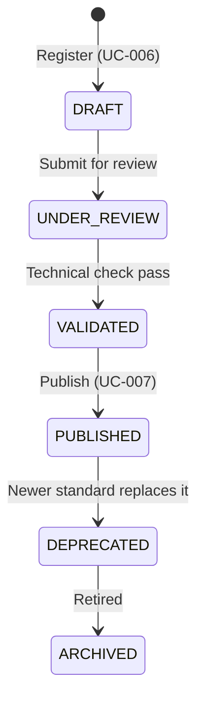

# Ciclo de Vida del Conocimiento (Knowledge Lifecycle)

**Proyecto:** RF_Observatory  
**Estado:** Activo  
**Fecha:** 16 de Julio de 2026

## 1. Concepto y Objetivos
Este documento explica el flujo de gobierno de conocimiento de RF_Observatory. El sistema diferencia estrictamente el almacenamiento empírico (Capturas, Evidencias, Fingerprints) de las afirmaciones oficiales sobre protocolos (Knowledge Base).

Como estipula la **DA-049 (El conocimiento es gobernado)**, ninguna observación se convierte automáticamente en un protocolo certificado sin revisión. Y como dicta la **DA-050 (Publicar no es registrar)**, existen dos transiciones de estado principales, operadas por endpoints separados.

## 2. Diferencia entre Registrar y Publicar

### Etapa 1: Registro (`POST /api/v1/protocols`)
- **Significado:** "Creo que este protocolo existe" o "Propongo documentar este comportamiento".
- **Estado Inicial:** El protocolo nace en estado `DRAFT` o `UNDER_REVIEW`.
- **Propiedades:** Es completamente mutable. Se le pueden seguir añadiendo referencias y corrigiendo la descripción o parámetros.
- **Caso de Uso:** `RegisterKnownProtocolUseCase` (UC-006).

### Etapa 2: Publicación (`POST /api/v1/protocols/{protocolId}/publish`)
- **Significado:** "La organización acepta este protocolo como conocimiento oficial".
- **Estado Final:** El protocolo cambia su estado a `PUBLISHED`.
- **Propiedades:** Su identidad principal se congela como conocimiento citable, auditable y expuesto al público general de la API.
- **Caso de Uso:** `PublishKnownProtocolUseCase` (UC-007).

## 3. Estados Posibles del Protocolo (El Embudo)

## 4. Responsabilidades de la Arquitectura
El `ProtocolController` no interviene en ninguna de las lógicas descritas arriba. Únicamente mapea las dos rutas REST hacia los comandos de dominio correspondientes. Toda transición de estado y validación de permisos de publicación pertenece a la capa `Application` (Casos de Uso) y `Domain` (Entidad `KnownProtocol`).

## 5. Trazabilidad Futura (Vision)
La separación entre DRAFT y PUBLISHED es el primer pilar para construir un repositorio auditable. En el futuro, un protocolo `PUBLISHED` en RF_Observatory retendrá un historial criptográfico o de base de datos vinculando exactamente qué UUIDs de Capturas y Comparaciones científicas se usaron para justificar su existencia.
