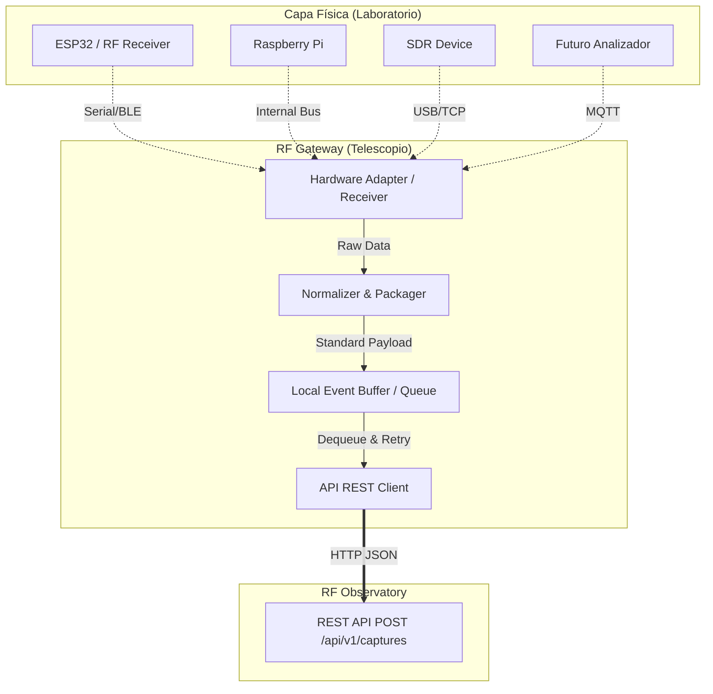

# 35_LaboratoryGatewayArchitecture

## 1. Objetivos y Filosofía
El **RF Gateway** (o Gateway de Laboratorio) es el componente de infraestructura que funge como puente bidireccional entre el mundo físico (hardware de captura) y el *RF_Observatory* (API REST).

### Filosofía de Diseño
* **Agnosticismo Físico:** El observatorio no sabe qué hardware capturó la señal; el hardware no sabe qué hace el observatorio con la señal.
* **Separación de Responsabilidades:** El hardware captura; el Gateway transporta y normaliza; el Observatorio clasifica y analiza. Queda **estrictamente prohibido** programar lógica científica, heurísticas o comparaciones de Fingerprints dentro del Gateway.
* **Confiabilidad del Transporte:** El Gateway asume la responsabilidad de manejar reintentos, caídas de red, timeouts y serialización, liberando al microcontrolador o SDR de cargas de red complejas.

## 2. Diagrama de Arquitectura


## 3. Flujo Completo
1. **Adquisición (Recepción):** El adaptador de hardware específico dentro del Gateway lee los datos raw (ej. a través de puerto Serial desde un ESP32).
2. **Normalización (Traducción):** El formato raw (ej. CSV de tiempos o strings en serie) se traduce a la interfaz intermedia de Captura definida por el Gateway (pulsos, duraciones).
3. **Empaquetado:** Se construye el payload JSON con la estructura exacta que requiere el DTO de `RegisterCapture` o `UploadEvidence`.
4. **Encolado (Buffer):** Se almacena temporalmente la captura en memoria o en disco (sqlite local, redis o cola simple) para evitar pérdida de datos si la red está caída.
5. **Transmisión (Envío HTTP):** El cliente HTTP del Gateway despacha el payload hacia `POST /api/v1/captures`.
6. **Manejo de Respuesta:** 
   - Si es exitoso (2xx), el Gateway desecha el mensaje de su buffer y registra el log de éxito.
   - Si falla (4xx), registra un log de error (ej. payload inválido) y desecha el mensaje.
   - Si hay caída de red (5xx o Timeout), el mensaje se retiene en el buffer para ser reintentado.

## 4. Interfaces y Protocolos Internos

El Gateway se estructurará mediante adaptadores intercambiables (Hexagonal a menor escala):

### Interfaz de Entrada (IHardwareAdapter)
Contrato para escuchar hardware físico.
```typescript
interface IHardwareAdapter {
  onDataReceived(callback: (rawData: Buffer | string) => void): void;
  connect(): Promise<void>;
  disconnect(): Promise<void>;
}
```

### Interfaz de Normalización (IPayloadNormalizer)
Traduce el formato específico del hardware al DTO genérico del Gateway.
```typescript
interface IPayloadNormalizer {
  normalize(rawData: any): GatewayCapturePayload;
}
```

### DTO Interno del Gateway (`GatewayCapturePayload`)
```typescript
type GatewayCapturePayload = {
  sessionId: string;
  sourceId: string; // ej. 'ESP32_LAB_1'
  frequency: number;
  modulation: string;
  pulseDurations: number[]; // microsegundos
  timestamp: string;
}
```

## 5. Responsabilidades Clave
1. **Manejo de Errores y Timeouts:** Timeout de red agresivo (ej. 5 segundos) para no bloquear lecturas concurrentes del hardware.
2. **Reintentos (Retry Policy):** Backoff exponencial para envíos fallidos al observatorio por caídas de red.
3. **Logging Local:** Cada captura despachada, reintentada o rechazada debe escribirse en un archivo de bitácora local (`gateway.log`). Útil para auditoría de laboratorio.

## 6. Estrategia de Expansión (Crecimiento)
El diseño permite crecer en dos ejes:
* **Hacia el Hardware (Southbound):** Para agregar un RTL-SDR, solo se debe programar un nuevo `SdrHardwareAdapter` que implemente `IHardwareAdapter` y un normalizador asociado. El cliente HTTP no sufre cambios.
* **Hacia el Servidor (Northbound):** Si el Observatorio en el futuro abre un socket o un broker MQTT (en lugar de REST HTTP), solo se crea un nuevo `IMessageDispatcher` para MQTT sin tocar el código que lee el ESP32.
